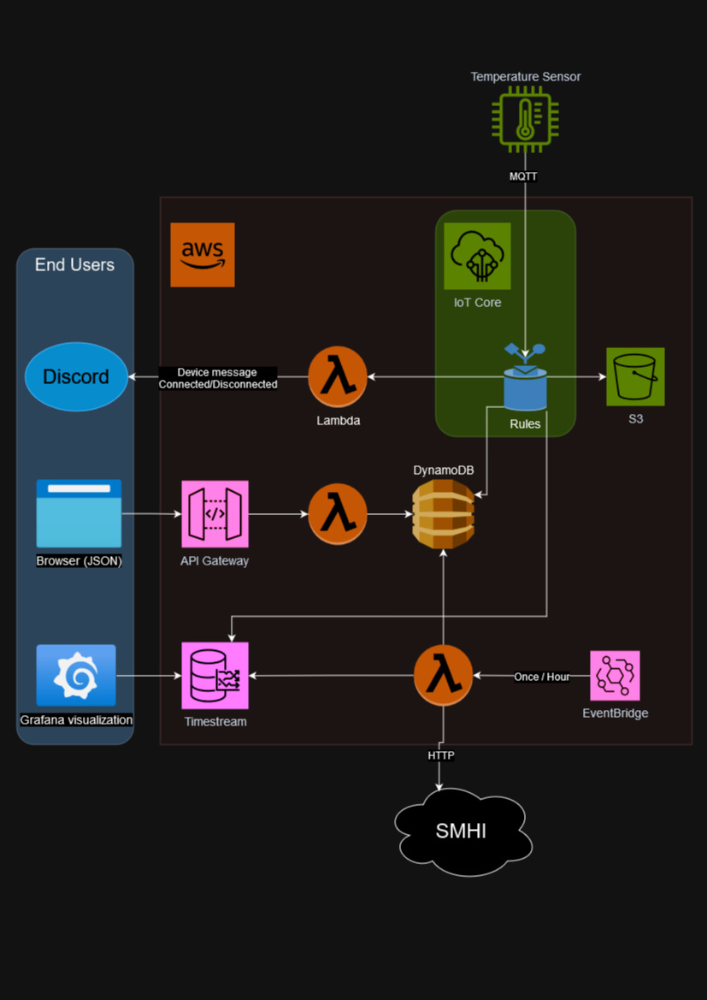
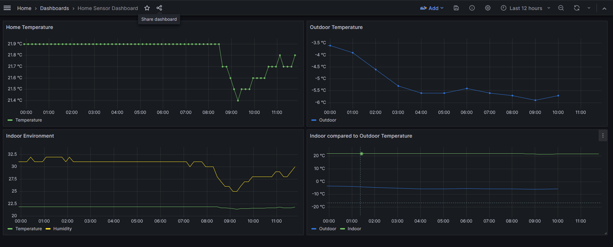
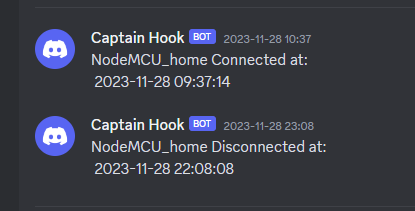
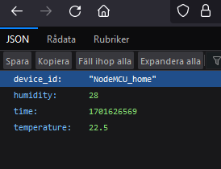

# Temperature Monitoring

An IoT project that utilizes AWS and other cloud-services to monitor and visualize indoor and outdoor temperature.<br/><br/>

 **Table of content:**

 - [Background](#Background)

 - [The Setup](#setup)
   - [Flowchart](#Flowchart)
   - [Description of flowchart](#description)
  - [Results](#results)
  - [Security and scalability](#security)


 


 <a id="Background"></a>
### Background
This project is made for Nackademin as part of a course in "IoT and Cloud-services".<br/>
The aim is to make up a hypothetical case/problem and create an Iot solution which<br/>
solves that problem. AWS or Azure must be used.


#### The Case
Winter is here and my rental apartment is drafty and my landlord controls the heating. <br/>
By setting up an indoor temperature sensor as well as collecting outdoor temperature, <br/>
via the SMHI-API, I hope to visualize how variations of outside temperature affect the <br/>
indoor temperature. Does a drop in outdoor temperature lead to a drop in <br/>indoor temperature as well or does my central heating keep it on a stable level?
***
<a id="setup"></a>
### The Setup

**The indoor data** is collected by using a NodeMCU V3 board. <br/>
NodeMCU V3 uses the esp8266 microcontroller which has wifi-capabilities. <br/>
Using keys and certificates generated by AWS the device can connect to the IoT core.<br/>
The board is connected to a DHT11 Sensor which collects the environmental data. <br/>
As you can see in the code, *main.ino*, the data is formatted into json and sent to <br/>
AWS using MQTT. Data is collected and sent every 10 minutes.

```c++
void publishMessage()
{
  StaticJsonDocument<200> doc;
  doc["time"] = tid;
  doc["humidity"] = h;
  doc["temperature"] = t;
  doc["device_id"] = THINGNAME;
  char jsonBuffer[512];
  serializeJson(doc, jsonBuffer); // print to client
 
  client.publish(AWS_IOT_PUBLISH_TOPIC, jsonBuffer);
}
```
<br/>

**The outdoor data** is collected from SMHI via their API using a AWS lambda function.<br/>
The function select what SMHI-data to access, formates it to suit our needs and <br/>
sends the data forward. SMHI update their data each hour, and I will collect it every hour.<br/>
<a id="Flowchart"></a>
### Flowchart



<a id="description"></a>
#### Description of flowchart

As you can see in the flowchart above there are two data entry points, the Sensor and SMHI. <br/>
Each of these follow different flows which I will now explain, starting with the Sensor data. <br/>

**The sensor** communicates with AWS IoT core using MQTT. As the messages enters the IoT core I have set up <br/>
Message Routing rules to determine how to handle the incomming data. The sensor data has four seperate flows.<br/>
1. **The S3 flow**: From message routing to S3 for long time storage
2. **The Discord flow**: Utilizing the lifecycel events of MQTT-devices, I use the connected/disconnected topics to <br/> trigger a lambda function which sends a message to discord, via webhook, whenever the device goes on or offline. <br/>This is a great tool for keeping track of unscheduled stops.

3. **The DynamoDB flow**: The third flow send the data to DynamoDB for storage. From here it can also be accessed <br/>from a browser via the api gateway I have set up. However, this is in preperation for a web application <br/> or some other application and not a finished solution. Right now you can only access the raw json; all or the latest data.
4. **The Grafana flow**:  By setting up a Timestream DB and table for the data, it is possible to create a connection <br/>between Grafana to AWS and utizlizing Grafanas tools to visualize the data.

<br/>**SMHI's data** is accessed through their API using two lambda functions in two different flows.

1. **The DynamoDB flow**: The first lambda function is triggered each hour using the EventBridge for time events. <br/>The lambda function collects and structures the latest SMHI data to fit into the same DDB table as the Sensor data.<br/> And then, of course, enter the data into the DDB table.

2. **The Grafana flow**: The second lambda work in very much the same way as the first. <br/>The only diffrence is that the data is put into the TimeStream table ( the same as the sensor data)<br/> and can then be accessed by Grafana and visualized. 
***
<a id="results"></a>
### Results

#### Visualization of the collected data


*Here are 12 hours of collected data from the Grafana visualization.*

Contrary to my theory, the outdoor temperature seem to have very little impact on the indoor temperature.<br/>The indoor temperature is kept impressively leveled, rarely dipping more than 0.5C.


#### The Discord message & API Gateway
 

The messages that you get when your device connect/disconnect and what you get when accessing the API gateway via browser. 

***
<a id="security"></a>
### Security and Scalability

As this is a project for learning and with limited time, best practices for security and<br/>
for scalability have not always been applied. There are some good points to consider in this<br/>
regard when building an IoT-solution using AWS. 

#### Security
- As all the connections to the AWS IoT core are TLS connections and authentication is <br/>
done with either x.509 certificates or Amazon Cognito. In this project I have hardcoded <br/>
the keys into the device code. Although in a seperate file, *secrets.h*, this is never a good practice.<br/> A better practice would have been to learn and use the AWS Key management service.<br/>
This would not only make it safer but also simplify the distribution of keys and certificates<br/> to multiple devices.

- Another important security principle is "least privledged". AWS uses Roles and Policies <br/>
to grant privileges to devices and users. These can be highly customized to suit the intended<br/> 
use. Making sure that every part can access only exactly what it need limits the damage that<br/>can  be done if a resource would be compromised. 

- As we're working with IoT devices it's also important to remeber to look at the physical <br/>security. Can the device be easily tempered with? Or can the environment damages it or <br/>
in some way unintended mess up the data? 

#### Scalability
One of the selling points of AWS, and similar cloud services, is how easy it is to scale. <br/>
Many of the services AWS provide auto-scale when usage increase and you only have to pay <br/>
for what is actually used. One example of this is the lambda functions which runs on demand<br/>and you only pay for the total runtime. If needed you can also use provisioning and <br/>throttling to control the traffic and with that also the cost of your solution. <br/>

